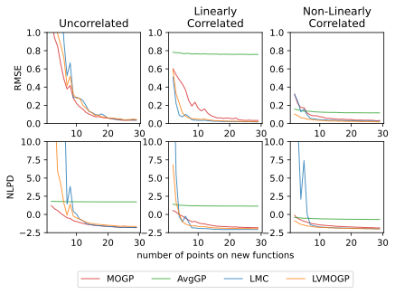

# Transfer Learning Gaussian Processes

Comparison of different transfer learning Gaussian process methods on synthetic data.
## Installation

To clone this repo use the command:
    
     git clone https://github.com/RSedgwick/Transfer_Learning_Gaussian_Processes.git

The code is written in Python 3.6. To install the required packages, ensure conda is installed and run the following 
command in the root directory of the project:

     conda env create -f environment.yml 

## Overview 

In this repo we run experiments to compare four different transfer learning methods:

1. Independent multioutput Gaussian process (MOGP)
2. Average Gaussian process where all data is considered to be from the same surface
3. Linear Model of Coregionalisation (LMC) 
4. Latent Variable Multioutput Gaussian Process (LVMOGP) [1]

We run experiments for all these methods on three different test function scenarios to contrast situations in which we
expect each model to perform well:
1. Unrelated test functions 
   1. if there is no negative transfer we would expect the MOGP, LMC and LVMOGP to perform similarly here
2. Linearly-related test functions
   1. We expect the LMC and LVMOGP to outperform the MOGP here
3. Non-linearly-related test functions
   1. We expect the LVMOGP to outperform the MOGP and LMC here

[1] [Dai, Zhenwen, Mauricio Álvarez, and Neil Lawrence. "Efficient modeling of latent information in supervised learning using gaussian processes." Advances in Neural Information Processing Systems 30 (2017).](https://arxiv.org/abs/1705.09862)

## Results

Below is a plot of the mean of the RMSE and NLPD for each of the methods for three different test function scenarios. 
For each scenario we have 10 new surfaces being learnt and 5 different random data sets.

And below is a gif of the predictions of each of the models for one test scenario, 
where one random datapoint is added each time.

## Code

Below is an overview of the code 
- `models`
  - `initializations.py` - Contains the initialization functions for the different transfer learning methods
  - `lvmogp.py` - Contains the code for the latent variable multi-output Gaussian process model, adapted from the GPflow Bayesian GPLVM code
  - `test_functions.py` - Code for generating the synthetic data
- `utils`
  - `utils.py` - Useful functions for initalising models, fitting them, getting performance metrics and saving results
  - `plotting_utils.py` - Useful functions for plotting functions and performance metrics
  - `analysis_utils.py` - Useful functions for analysing the results
- `notebooks`
  - `Comparing_LVMOGP_Prediction_Methods.ipynb` - Notebook for comparing different methods for prediction using the LVMOGP
  - `LMC_fitting_and_intialisation.ipynb` - Notebook demonstrating the fitting of the LMC
  - `lmc_setting_W_and_kappa.ipynb` - Notebook demonstrating how the LMC can recreate the independent MOGP
- `analysis`
  - `plots` - various plots that have been generated
  - `model_comparison.ipynb` - Notebook comparing the RMSE and NLPD of the different models from the many learning curve runs
  - `plot_predictions.ipynb` - plot the predictions of the models for a given seed, data seed and number of training points. 
Also plot the log marginal likelihood of the different initialisations at each number of training points for all models. 
  - `plot_predictions.py` - plot the predictions for all runs, to be made into gifs
  - `animating_plots.ipynb` - notebook for making gifs out of predictions
- `learning_curves.py` - this script is used for fitting each of the models, analysing the results and saving them to a file
  - The `.pbs` scripts can be used to run this many times for different seeds and number of training points on a cluster